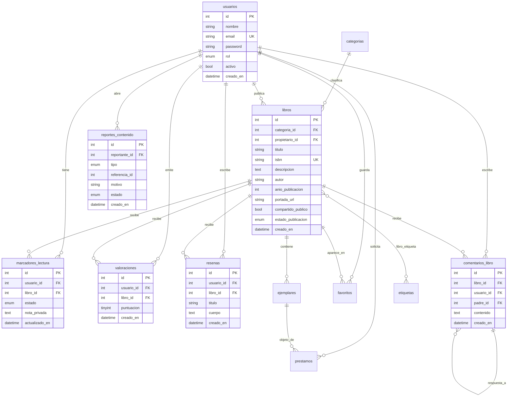

# Esquema entidad–relación (base de datos)

Modelo lógico de la aplicación de biblioteca social: catálogo, aportaciones de usuarios, interacción (valoraciones, reseñas, comentarios, lectura) y préstamos físicos.

## Diagrama E/R (Mermaid)

## Roles (`usuarios.rol`)

| Valor            | Uso principal                                              |
|------------------|------------------------------------------------------------|
| `usuario`        | Valorar, reseñar, comentar, marcar lectura, favoritos, publicar obras propias |
| `moderador`      | Revisar contenido reportado y colas de publicación        |
| `bibliotecario`  | Gestión de ejemplares y préstamos                         |
| `admin`          | Configuración global y usuarios                           |

## Estados de publicación (`libros.estado_publicacion`)

- `borrador` — solo visible para el autor (la API pública los excluye).
- `pendiente_revision` — enviado a moderación.
- `publicado` — visible según reglas de catálogo.
- `rechazado` — no listado en catálogo público.

Los listados públicos de la API solo incluyen `publicado` y, si hay propietario, `compartido_publico = 1`.

## Lectura (`marcadores_lectura.estado`)

`pendiente` · `en_curso` · `leido`, más `nota_privada` opcional por usuario y libro.

## Fuente SQL

El script canónico que crea y puebla las tablas está en `docker/mysql/bd.sql` (arranque del contenedor MySQL).
